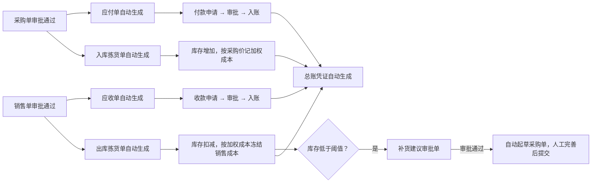
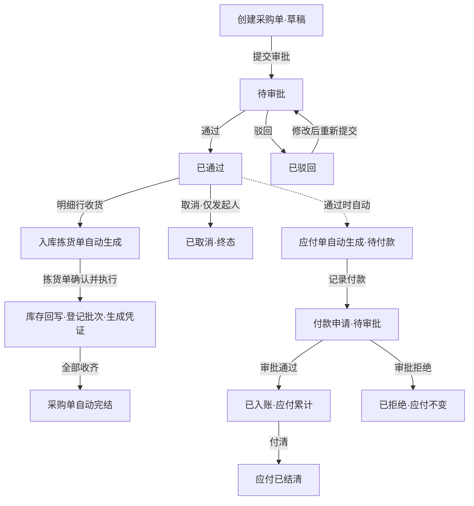

# GoWind ERP 用户手册

> 本手册面向 GoWind ERP 的日常使用者：企业管理员、采购员、仓管员、销售员、财务人员、审批人，以及自部署场景下的平台管理员。
>
> 基于 2026-08-29 的系统功能编写，对应仓库 main 分支。管理后台（Web）与移动端 App 均已覆盖，分别见第 5 章、第 6 章。

---

## 目录

- [1. 产品简介](#1-产品简介)
- [2. 快速入门](#2-快速入门)
- [3. 角色与权限](#3-角色与权限)
- [4. 核心业务流程](#4-核心业务流程)
- [5. 功能模块详解](#5-功能模块详解)
- [6. 移动端 App](#6-移动端-app)
- [7. 常见问题（FAQ）](#7-常见问题faq)
- [附录 A. 单据状态速查表](#附录-a-单据状态速查表)
- [附录 B. 术语表](#附录-b-术语表)

---

## 1. 产品简介

### 1.1 GoWind ERP 是什么

GoWind ERP 是一款专为中小团队打造的轻量级、一体化 ERP，覆盖**采购、库存、销售、财务**四大核心业务：

- **免实施顾问** — 注册即开通：企业（租户）、部门、角色、管理员自动初始化，权限、审批、站内消息、审计等基座能力全部内置；
- **半天上手** — 管理后台 + 手机 App 双端齐备，采购 → 审批 → 收货 → 库存 → 付款的核心链路开箱即走；
- **核心业务数据全打通** — 单据驱动单据：审批完的采购单自动生成应付，收货自动回写库存，低库存自动给出补货建议；数据在一处录入，全链路生效。

### 1.2 核心业务链路总览

### 1.3 双端形态

| 端 | 形态 | 适用场景 |
|:---|:---|:---|
| 管理后台 | 浏览器访问的 Web 应用 | 单据录入、审批配置、报表查看、组织权限管理等全部功能 |
| 移动端 App | Flutter 跨平台应用（iOS / Android），界面语言跟随手机系统（中文/英文） | 随时随地审批（可下钻查看单据原文）、仓库现场作业（扫码枪/手工输入 SKU，调拨、盘点、批次查询、销售退货）、销售单查询、经营看板 |

App 与管理后台使用同一套企业账号，数据实时互通；两端分工详见 [6.6 节](#66-app-与管理后台分工一览)。

---

## 2. 快速入门

### 2.1 注册开通企业

打开管理后台登录页，点击「注册」，填写：

| 字段 | 说明 |
|:---|:---|
| 企业名称 | 您公司的名称，仅用于展示 |
| 租户编码 | 登录时使用的唯一编码，字母/数字/下划线/横线，至少 2 位 |
| 管理员账号 | 本企业的首个管理员用户名 |
| 密码 | 至少 6 位，带强度提示 |
| 图形验证码 | 点击图片可刷新 |

勾选同意隐私政策与服务条款后提交。系统会自动完成初始化，**无需任何手工配置**：

- 创建管理员账号并授予租户管理员角色；
- 创建默认仓库 **MAIN** 及供应商/客户/盘损等虚拟库存位置；
- 写入演示数据：5 个商品 SKU、2 个供应商、2 个客户。

注册成功后即可用管理员账号登录，直接开始开单。

### 2.2 登录

登录页需要填写：

- **租户编码**：企业注册时填写的编码（平台管理员账号可不填）；
- **用户名 / 密码**；
- **图形验证码**：点击图片可刷新，校验失败会自动换一张。

登录后默认进入「库存总览」看板首页。顶栏右侧提供：站内消息铃铛（实时推送）、个人设置、锁屏、退出登录。

### 2.3 初始化向导

租户管理员和平台管理员可在浏览器地址栏访问 `/onboarding/wizard` 打开初始化向导。页面顶部的绿色卡片会提示「已自动完成」的内容（管理员账号、MAIN 仓库、虚拟库存位置），下方按顺序给出五步引导，点击即可跳转到对应页面：

1. **添加商品** — 录入商品 SKU、规格与单位，采购销售均按 SKU 流转；
2. **添加供应商** — 供应商是采购单的往来单位，审批通过后自动生成应付；
3. **添加客户** — 客户是销售单的往来单位，审批通过后自动生成应收；
4. **创建首张采购单** — 采购入库自动增加库存并按单价记录加权成本；
5. **创建首张销售单** — 销售出库自动扣减库存、冻结成本，利润报表实时可见。

### 2.4 半天上手推荐路径

刚接手系统时，建议按以下顺序走通一遍完整业务，即可理解系统的全部核心概念：

1. 在「仓储管理 → 商品管理」录入 2~3 个商品；
2. 在「采购管理 → 供应商管理」录入一家供应商；
3. 在「销售管理 → 客户管理」录入一家客户；
4. 创建一张小额采购单 → 提交审批 → 让另一位有审批权限的同事通过；
5. 在采购单明细行点「收货」，到「仓储管理 → 拣货单」确认并执行，观察「库存量」页变化；
6. 到「财务管理 → 应付管理」查看自动生成的应付单，发起一笔付款申请并审批入账；
7. 再走一张销售单（发货出库 → 应收 → 收款），最后看「经营看板」和「利润报表」。

### 2.5 界面总览

- **左侧菜单**：按您的角色动态渲染，看不到的模块说明当前账号无权限（见[第 3 章](#3-角色与权限)）；
- **多标签页**：可同时打开多个页面，固定标签（如库存总览）常驻；
- **通知铃铛**：站内消息实时推送（SSE），支持标记已读、全部已读、清空；
- **用户菜单**：个人设置（头像、昵称、联系方式、修改密码）、站内消息、退出登录；
- **列表页统一布局**：顶部搜索区 + 工具栏按钮（创建、导出等）+ 数据表格，行内操作按钮随单据状态动态显隐。

### 2.6 通用操作约定

**金额单位（重要）**

系统内部以「分」记账，**所有列表和报表中的金额均以「元」展示**；但单据录入时的金额输入框（采购/销售明细单价、手工应付/应收金额、付款/收款金额）以「**分**」为单位，输入框上有「（分）」标注。

换算：1 元 = 100 分。例如单价 25.50 元，输入 `2550`。

**数量**

明细数量必须为正数；单价不能为负数。

**打印**

采购单、销售单、拣货单、往来对账单均支持打印，打印模板自动包含单据明细、大写金额与签字栏。

**收不到提醒？**

站内消息在三类时点自动发送：审批审结时通知申请人、多级审批级进时通知下一级审批人、补货草稿就绪时通知申请人。提单送审本身不发通知，请养成关注右上角铃铛的习惯。

---

## 3. 角色与权限

### 3.1 内置角色与可见菜单

| 角色 | 典型人员 | 可用功能 |
|:---|:---|:---|
| 平台管理员 | 自部署/运营方 | 全部功能，含租户管理、套餐管理、日志审计、权限点/菜单/API 管理、数据字典、登录策略、语言管理 |
| 租户管理员 | 企业老板 / 管理员 | 经营看板、全部业务模块（仓储/采购/销售/审批/财务）、组织人员、角色管理、站内消息、文件与任务调度、订阅管理、初始化向导 |
| 采购员 | 采购部 | 采购管理（采购单、供应商） |
| 仓管员 | 仓库 | 仓储管理（商品、仓库、库存量、拣货单、批次库存） |
| 销售员 | 销售部 | 销售管理（销售单、客户） |
| 财务员 | 财务部 | 财务管理（应付/应收/付款/收款及全部财务报表） |
| 审批人 | 各级主管 | 审批中心（审批管理） |

说明：

- 一个用户可以绑定**多个角色**（如「采购员 + 审批人」），菜单取并集；
- 除上表外，租户管理员可在「权限管理 → 角色管理」自定义角色并分配菜单、接口与数据权限；
- 审批流配置的每一级绑定一个角色，**该角色下必须至少有一名用户**（且审批时会排除申请人本人），否则该级会无人可审。

### 3.2 数据隔离与按钮级权限

- **租户隔离**：每个企业（租户）的数据完全隔离，任何查询都强制携带租户条件；
- **按钮级控制**：权限精确到按钮（如「通过」「收货」「删除」），即使能看到页面，无权限的操作按钮也不会出现或会被服务端拒绝；
- **服务端强校验**：所有关键规则（状态机、防超收、防超付、禁止自审自批、信用额度）都在服务端强制执行，前端拦截只是第一道防线。

### 3.3 给员工开通账号

租户管理员进入「组织人员 → 用户管理」：

1. 点击「创建账号」，填写用户名、初始密码，并勾选**角色**、**所属组织**、**岗位**；
2. 员工首次登录后可在「个人设置」修改密码、完善个人信息；
3. 需要调整时，进入用户详情页可修改密码、禁用账号、查看其权限信息、API 日志与收件箱。

建议：先在「组织管理」建好部门树、在「职位管理」建好岗位，再批量开账号。

---

## 4. 核心业务流程

### 4.1 采购到付款（核心链路）

分步操作：

1. **创建采购单**（采购员）：选择供应商（仅启用状态）、收货仓库，添加明细（SKU + 数量 + 单价）。保存后为「草稿」。
2. **提交审批**：单据进入「待审批」，系统自动生成审批单（配置了多级审批流时逐级推进）。
3. **审批**（审批人）：在「审批中心」或采购单列表直接通过/驳回。**审批人不能是制单人本人**。驳回后采购员可修改重新提交。
4. **自动联动**（审批通过瞬间，系统自动完成）：
   - 生成该采购单的**全额应付单**；
   - 生成**入库拣货单**及每条明细的草稿移库行。
5. **收货**（仓管员）：在采购单明细行点「收货」，填写收货数量（不能超过剩余数量）与批次信息（可选）；再到「仓储管理 → 拣货单」对入库单点「确认」「执行」。执行成功即回写库存与采购单已收数量。
6. **自动完结**：所有明细收齐时，采购单自动流转为「已完结」；也可以在「已通过」状态手动完结。
7. **付款**（财务员）：在「财务管理 → 应付管理」打开应付单，点「记录付款」，填写金额与付款方式。付款是**申请—审批—入账**三段式：提交后生成待审批付款单，审批通过后入账并累计到应付单（自动防超付），应付单随付款进度从「待付款」→「部分付款」→「已结清」。

### 4.2 销售到收款

与采购链路完全对称：

1. **创建销售单**（销售员）：选择客户、发货仓库，添加明细。
2. **提交审批 → 审批**：规则同采购单（禁止自审、可驳回重提）。
   - **客户信用额度在审批通过时校验**：该客户当前未清应收余额（不含本单）+ 本单金额 ≤ 信用额度，否则审批被拒绝并提示「信用额度不足」。额度为 0 或留空表示不限制。可在「客户管理」为每个客户设置额度。
3. **审批通过自动联动**：生成全额**应收单**、自动过账收入确认凭证、生成**出库拣货单**。
4. **发货**（仓管员）：出库拣货单确认并执行后，库存扣减、销售成本按加权平均冻结、已发数量回写；全部发齐后销售单自动完结。
5. **收款**（财务员）：应收单上发起收款申请，审批通过后入账，应收单走向「待收款 → 部分收款 → 已结清」。

### 4.3 审批是怎么工作的

- **自动送审**：采购单、销售单、付款单、收款单在提交时自动生成审批单，无需手工发起；
- **单级与多级**：默认单级审批。租户管理员可在「审批中心 → 审批流配置」为每类业务（采购单/销售单/付款/收款）配置一条多级审批流，每级绑定一个角色，按顺序逐级推进；终级通过才真正生效；
- **级进通知**：多级审批中，某级通过后系统自动站内信通知下一级候选审批人；
- **禁止自审自批**：申请人不能审批自己的单据，服务端强制拦截；
- **审批与业务同义**：审批通过瞬间完成业务回写（状态迁移、生成应付/应收/拣货单、入账等），若业务校验失败（如信用额度不足），审批动作整体失败，审批单保持待审批、可重试；
- **撤销**：审批中的单据可由申请人本人撤销；已审结的审批记录作为审计凭据保留，不可删除（仅已撤销的审批单可删除）。

> 配置了多级审批流后，业务单据页上的直接「通过/驳回」按钮会被闸门拦下，提示到审批中心逐级审批——这是预期行为。

### 4.4 退货怎么办

系统没有通用的「红冲」按钮，错误通过**退货单**或**盘点单**纠正：

| 场景 | 入口 | 效果 |
|:---|:---|:---|
| 采购退货 | 采购单（已通过/已完结）明细行「采购退货」 | 生成出库拣货单（仓库→供应商）；执行后回退已收数量、**同时下调应付单金额与已付金额（双降冲抵）**；若已完结采购单退后未收齐，自动重开为「已通过」 |
| 销售退货 | 销售单（已通过/已完结）明细行「销售退货」 | 生成入库拣货单（客户→仓库）；执行后回退已发数量、冲减应收（双降冲抵）、退货按当前均价回库存并冲减收入 |
| 执行错误的出入库 | 无冲正入口 | 用盘点单修正库存数量；财务影响通过退货/调整流程处理 |

退货数量不能超过已收/已发数量（防超退）。退货拣货单创建后，同样需要到「拣货单」页确认并执行。

### 4.5 库存盘点与调拨

「仓储管理 → 拣货单」页可手工创建两类单据（**入库/出库拣货单只能由采购/销售审批自动生成，不能手工创建**）：

- **调拨**：选择源仓库与目的仓库（不能相同），填写产品与数量。执行后库存按库位原子转移，成本随行；
- **盘点（库存调整）**：选择仓库，填写**带符号的差异数量**——正数为盘盈、负数为盘亏，不能为 0。**同一张盘点单必须全为盘盈或全为盘亏**，混合差异请拆成两张单。执行后过账待处理财产损溢科目。

### 4.6 低库存自动补货

每次出库执行成功后，系统自动评估被扣减的 SKU：

1. 库存数量低于阈值（默认 10）；
2. 且该 SKU 没有在途补货采购单（已提交/已通过且未收满）；
3. 且没有未决的补货审批单；

同时满足则生成一条「低库存补货建议」审批单。**审批通过后**系统自动起草一张采购单草稿：供应商取该 SKU 最近一次的采购来源（无历史供应商则只留痕、不建单），建议数量为补到阈值的 2 倍，单价为 0。

> 补货不是自动下单：草稿采购单需要采购员补全单价等信息的**人工提交**才进入审批流程。系统通过站内信通知申请人「补货草稿已创建」。

---

## 5. 功能模块详解

> 每节标注主要使用角色；菜单可见性以[第 3 章](#31-内置角色与可见菜单)的角色权限为准。

### 5.1 经营看板（概览 → 库存总览）

默认首页，租户管理员与平台管理员可见：

- **库存指标**：仓库数、在库 SKU、库存总量、流水数；
- **财务指标**：本月收入、本月成本、本月利润、应收/应付余额（元）；
- **临期批次预警**：30 天内到期的批次清单（批次号、产品、效期、余量），标题栏显示待处理数量；
- **近 30 日库存流水趋势**：折线图；
- **低库存清单**：低于阈值的库位与数量（红色标出）。

### 5.2 仓储管理（仓管员）

| 页面 | 说明 |
|:---|:---|
| 商品管理 | 维护商品 SKU：编码、名称、规格、单位、启用状态。采购/销售/库存均按 SKU 流转 |
| 仓库管理 | 维护仓库编码、名称、地址、启用状态。每个仓库自动拥有内部库位 |
| 库存量 | 只读查询各库位的现存量（库位、产品、数量），支持搜索与导出。库存量只能通过拣货单执行变动，不能手工改数 |
| 拣货单 | 出入库/调拨/盘点的执行入口（详见下文） |
| 批次库存 | 只读查询批次号、产品、效期、余量与效期状态（正常/临期/已过期），支持按效期状态筛选 |

**拣货单页要点**：

- 列表列：拣货单号、类型（入库/内部/盘点）、派生态、创建时间；
- 行内操作按状态提供：**确认**（草稿）→ **执行**（已确认）→ 完成后不可再动；**打印**随时可用；**删除**仅草稿/已取消；
- 派生态是从明细行汇总出来的：草稿（有草稿行）→ 已确认（有已确认行）→ 已完成（全部完成）；
- **批次**：入库执行时可登记批次号与效期（留空表示不跟踪批次）；出库执行时可手工指派批次（余量不足会报错），不指派则系统按 **FEFO（先到期先出）**自动拆分扣减。

### 5.3 采购管理（采购员）

**供应商管理**：维护编码、名称、联系人、电话、启用状态。仅启用状态的供应商可被采购单选用。

**采购单**：

- 列表：单号、供应商、状态、总额（元）、创建时间；支持按单号/供应商/状态搜索；
- 新建/编辑抽屉：供应商、收货仓库、备注 + 明细行（SKU、数量、单价「分」）；明细可增删；保存后服务端自动计算总额；
- 编辑仅限「草稿/已驳回」，删除仅限「草稿/已取消」；
- 状态与可用操作：

| 状态 | 行内可用操作 |
|:---|:---|
| 草稿 | 编辑、提交审批、取消、删除 |
| 待审批 | 通过、驳回、取消（配置了多级审批流时，请在审批中心逐级操作） |
| 已通过 | 完结、取消；明细行「收货」（有剩余数量时） |
| 已完结 | 明细行「采购退货」（有已收数量时） |
| 已驳回 | 编辑后重新提交、取消 |
| 已取消 | 删除（终态，不可再流转） |

- **收货弹窗**：收货仓库（预填采购单仓库）、收货数量（默认剩余量，不能超收）、批次登记（每行 SKU 可填批次号 + 效期，留空不跟踪）。确认后请到拣货单页执行入库；
- **采购退货弹窗**：退货数量 ≤ 已收数量。创建后到拣货单列表确认并执行；
- **打印**：标准采购单模板，含明细、合计大写金额与制单/审批/供应商确认/收货人/仓管员/复核人签字栏。

### 5.4 销售管理（销售员）

与采购管理完全对称：

- **客户管理**：编码、名称、联系人、电话、启用状态、**信用额度（元，0 或空 = 不限）**；
- **销售单**：客户 + 发货仓库 + 明细；状态机与操作同采购单（草稿→提交→通过/驳回→发货→完结/取消）；明细行「销售退货」在已通过/已完结且有已发数量时可用；
- 审批通过时校验客户信用额度（见 4.2）；发货出库走拣货单执行；
- 支持打印标准销售单。

### 5.5 审批中心（审批人 / 租户管理员）

**审批管理**：

- 列表：审批标题、业务类型、业务单据、审批状态、审批进度（第 x/y 级）、审批意见、创建时间；
- 详情抽屉：显示业务类型、单据引用与摘要，输入审批意见（可选）后**通过 / 驳回 / 撤销**（撤销仅申请人本人、仅待审批状态）；
- 工具栏「发起审批」用于极少数需要手工补建审批单的场景（业务单提交时通常会自动送审，无需手工发起）；
- 审批状态：待审批 → 已通过 / 已驳回 / 已撤销。

**审批流配置**（租户管理员）：

- 每个业务类型（采购单 / 销售单 / 付款 / 收款）至多一条生效流程；
- 流程由有序的「审批级」组成，每级填写级名称（如「主管复核」）并绑定一个角色；
- 至少需要一级；单级即传统直接审批；
- 修改/删除流程不影响已在途的审批单（在途单按提交时的快照执行）。

### 5.6 财务管理（财务员）

| 页面 | 用途 | 要点 |
|:---|:---|:---|
| 应付管理 | 对供应商的应付账款 | 采购审批自动生成，也可「手工建账」（供应商 + 金额 + 备注）。详情页可「记录付款」「取消」；删除/取消仅限待付款且已付为 0 |
| 应收管理 | 对客户的应收账款 | 销售审批自动生成或手工建账，操作与应付对称（记录收款/取消） |
| 付款流水 | 付款单只读台账 | 待审批 → 已入账 / 已拒绝；一经入账不可修改删除 |
| 收款流水 | 收款单只读台账 | 同上 |
| 应付账龄 | 逾期风险监控 | 未结清应付按到期日分桶：已逾期 / 0-7 / 8-30 / 31-90 / 90 天以上 / 无账期，统计笔数与未清余额 |
| 应收账龄 | 回款风险监控 | 与应付账龄对称 |
| 利润报表 | 月度经营成果 | 月份、收入、销售成本、利润（元）。仅供经营参考 |
| 凭证查询 | 总账凭证流水 | 按记账日期筛选；凭证行可展开查看分录（科目、借方、贷方）。全部凭证由业务事件自动生成，无手工凭证入口 |
| 科目余额表 | 试算平衡 | 科目编码、名称、期末余额，借贷必等 |
| 往来对账 | 与客户/供应商对账 | 选往来单位类型 + 单位后查询：日期、单据、发生额、核销额、期末余额，支持打印对账单（含对方确认签字栏） |
| 销售排行 | 销售分析 | 按商品或按客户维度 + 月份筛选，展示排名、销量、金额与柱状图，可导出 Excel |

**自动记账规则**：采购入库（借库存/贷应付）、销售成本（借成本/贷库存，按冻结的加权成本）、销售获批收入确认（借应收/贷收入）、收付款入账（借资金/贷应收付）、采购退货（借应付/贷库存）、销售退货库存与收入冲减、盘点损溢（待处理财产损溢）。财务无需手工记账，报表实时可查。

**付款安全线**：防超付在入账时原子校验；部分付款的应付单不能取消，只能继续付清。

### 5.7 组织与人员（租户管理员）

- **组织管理**：多级组织树（部门/团队/集团/事业部/项目组/委员会/区域中心/子公司/分公司/其他），可维护负责人、排序、法定主体信息等；
- **职位管理**：职位树、职位类型（普通/领导/管理/实习/合同/其他）、编制人数、职责描述，挂靠组织；
- **用户管理**：创建账号（绑定角色/组织/岗位）、禁用/启用、修改密码；用户详情页含基础信息、权限信息、API 日志、收件箱四个标签页。

### 5.8 权限管理（租户管理员；权限点/菜单/API 为平台管理员）

- **角色管理**：自定义角色，分配 API、权限点与菜单；内置角色受保护不可删；
- **权限点管理**（平台）：权限分组与权限点维护，可将权限点分配到菜单与 API；
- **菜单管理**（平台）：目录/菜单/按钮三级可视化配置，图标、路由、显隐、权限标识、排序；
- **API 管理**（平台）：接口路径/方法/模块登记，「同步 API」可从代码自动同步接口清单。

### 5.9 站内消息（租户管理员）

- **消息管理**：发布消息（选择分类与类型：通知/私信/群聊；支持草稿、定时发布、撤销、归档），查看发送状态；
- **消息分类**：维护多级消息分类；
- 普通用户通过顶栏铃铛接收实时推送（审批通知、补货通知、管理员群发），支持已读管理。

### 5.10 日志审计（平台管理员）

五类只读日志：登录日志（IP、地点、平台、失败原因、风险评分）、API 日志（调用路径、耗时、状态）、操作日志（资源、动作、前后数据快照、敏感等级）、数据日志（数据表访问与脱敏记录）、权限日志（授予/回收/重置等权限变更及原因）。

### 5.11 系统管理

| 页面 | 权限 | 说明 |
|:---|:---|:---|
| 数据字典 | 平台管理员 | 字典大类与字典项维护，多语言翻译联动 |
| 文件管理 | 租户管理员 | 统一文件上传（带进度）、下载、删除 |
| 任务调度 | 租户管理员 | 定时任务的启动/暂停/重启/立即执行，查看执行记录与日志 |
| 登录策略 | 平台管理员 | 黑/白名单，按 IP/MAC/地区/时间/设备限制登录 |
| 语言管理 | 平台管理员 | 语种与翻译内容维护 |

### 5.12 订阅与定价

- **我的订阅**（租户管理员）：展示当前套餐、用户数与本月单量的用量进度、到期时间；到期后数据保留只读，续费 30 天即可恢复；可在套餐卡片间升级/降级；
- **套餐管理**（平台管理员）：查看平台套餐定义。

| 套餐 | 月价 | 用户上限 | 月单量上限 |
|:---|:---|:---|:---|
| FREE | 免费 | 3 | 100 |
| STANDARD | ¥99 | 10 | 5 000 |
| PRO | ¥299 | 不限 | 不限 |

超出用户数不影响存量登录，**当月单量超限或订阅到期时会拦截新建采购单/销售单**，数据始终保留。

### 5.13 租户管理（平台管理员）

平台运营视角管理全部企业租户：创建租户（含管理员账号与初始密码）、审核（待审核/已通过/已拒绝）、启停（启用/停用/过期/冻结）、查看租户类型（试用/付费/内部/合作伙伴/定制）。新租户创建后自动完成管理员与基础数据初始化。

### 5.14 个人中心

右上角头像 →「个人设置」：

- **基本设置**：头像上传、昵称、姓名、邮箱、手机、住址等；
- **修改密码**：旧密码验证后设置新密码；
- 安全设置/账号绑定/消息通知为模板预留页，以实际可用功能为准。

---

## 6. 移动端 App

移动端 App（Flutter，支持 iOS / Android）与管理后台使用同一套企业账号、同一份数据，界面语言跟随手机系统设置（中文/英文）。App 采用底部四标签导航：**看板 / 审批 / 仓储 / 销售**。

服务器地址由部署包内置配置，用户无需（也无法）在 App 内修改。

### 6.1 登录与会话

- **登录页**：填写「租户编号」（留空表示平台登录）、「用户名」、「密码」。App 端登录不需要图形验证码；登录失败会提示「登录失败，请检查用户名和密码」。
- **会话自动续期**：访问令牌到期前系统自动续期，无感刷新；续期失败或令牌失效时会自动退出到登录页，重新登录即可。
- **退出登录**：入口在「看板」页右上角。

### 6.2 看板（管理层）

打开 App 的默认首页，下拉即可刷新：

- **库存指标卡（2×2）**：仓库数、在库 SKU、库存总量、流水数；
- **财务指标卡（2×2）**：本月收入（元）、本月成本（元）、本月利润（元）、应收/应付（元）；
- **低库存清单**：低于阈值的库位与产品，数量红色标出；空态显示「暂无低库存项」。

指标卡为纯展示，暂不支持点击下钻；完整报表（账龄、利润、对账单等）请在管理后台查看。

### 6.3 审批中心（审批人）

**列表**：顶部状态筛选「全部 / 待审批 / 已通过 / 已驳回 / 已撤销」，支持下拉刷新。每张审批卡片显示：

- 审批标题与状态标签（待审批-橙 / 已通过-绿 / 已驳回-红 / 已撤销-灰）；
- 多级审批时显示进度角标（如「1/3」，表示当前第 1 级共 3 级）；
- 业务类型（由字典解析为文案）· 单据引用 · 摘要。

**操作**（仅待审批卡片）：

- 点 **✓ 通过** 或 **✗ 驳回**：弹窗内可填写「审批意见」（可选），确认后列表自动刷新；
- **长按卡片 → 撤销**：确认弹窗后撤销审批（仅申请人本人可撤销，服务端校验）；
- 若被服务端拒绝（单据状态已变化、无权限、触发禁止自审自批等规则），会提示「操作被拒绝：状态已变更或无权限」。

**下钻查看单据原文**：点击业务类型为**采购单**或**销售单**的审批卡片，可直接跳转到 App 内对应的采购单/销售单详情页，审批前先看清单据内容再决策。

### 6.4 仓储作业（仓管员）

仓储页是一条「查库存 → 做动作」的流水线，从上到下依次为：

1. **选择仓库**：下拉选择当前作业仓库（显示「编码 — 名称」）；
2. **输入/扫描 SKU**：在输入框中输入或用扫码枪扫入产品编码（支持键盘注入式扫码枪，App 不调用摄像头），点「查询」；未找到时提示「未找到该 SKU 的库存记录」；
3. **库存卡**：显示该 SKU 的「当前库存」；
4. **批次余量卡**（该 SKU 有批次时显示）：逐行显示批次号、效期（或「不限期」）、余量与效期状态标签（正常-绿 / 临期-橙 / 过期-红），收发货现场可据此核对批次；
5. **调拨 / 盘点按钮**：基于刚查询到的 SKU 直接发起作业（未先查询会提示「请先查询 SKU 库存」）；
6. **近期流水卡**：只读展示最近 20 条拣货单（单号、类型、状态）。

**调拨**：弹窗中选择目的仓库（自动排除当前仓库）并填写数量（正整数、不能超过当前库存），点「确定」。App 会一次性完成**创建 → 确认 → 执行**，成功提示「调拨成功」并自动刷新库存，无需再确认第二步。

**盘点**：弹窗中填写「差异数量」——正数=盘盈、负数=盘亏（不能为 0，盘亏不能超过现存量）。确认后同样一步生效，提示「盘点已生效」。

> 说明：入库/出库拣货单**不能**在 App 中创建或执行——它们由采购单/销售单审批通过后自动生成，请到管理后台「仓储管理 → 拣货单」执行。批次在 App 中为只读查询；出库时的批次扣减由服务端按 FEFO（先到期先出）自动完成。

### 6.5 销售（销售员）

- **销售单列表**：状态筛选「全部 / 草稿 / 待审批 / 已通过 / 已完结 / 已取消」；卡片显示单号、状态标签、客户与总额，点击进入详情；
- **销售单详情**：表头显示客户、仓库、总额、状态、备注；明细区逐行显示 SKU、数量与已履约数量；
- **销售退货**：已通过/已完结的订单，已履约数量大于 0 的明细行会显示「退货」按钮。弹窗中填写退货数量（1 ~ 已履约数量，默认填满），确认后创建退货入库拣货单，提示「退货拣货单已创建，请到拣货单列表执行确认与校验」——即退货单在 App 发起后，仍需到管理后台拣货单页执行入库；
- **采购单详情**：从审批卡片点击进入，只读查看供应商、仓库、总额、状态与明细已收数量。**采购退货不在 App 端提供**，请到管理后台操作。

### 6.6 App 与管理后台分工一览

| 操作 | App | 管理后台 |
|:---|:---:|:---:|
| 创建/编辑采购单、销售单 | — | ✓ |
| 审批（通过/驳回/撤销） | ✓ | ✓ |
| 审批时下钻查看采购/销售单原文 | ✓ | ✓ |
| 调拨、盘点 | ✓（一步完成） | ✓（分步执行） |
| 入库/出库拣货单的确认与执行 | — | ✓ |
| 销售退货 | ✓（发起，Web 执行） | ✓（发起+执行） |
| 采购退货 | — | ✓ |
| 批次/效期查询 | ✓（只读） | ✓（只读） |
| 经营看板 | ✓（精简版） | ✓（含流水趋势、临期预警） |
| 财务报表、账龄、对账、组织权限、系统管理 | — | ✓ |

---

## 7. 常见问题（FAQ）

**Q1：为什么我不能审批自己提交的单据？**
系统禁止自审自批，制单人不能审批自己的采购单/销售单/审批单。请让持有对应审批角色的其他人审批；多级审批流中每一级也会自动排除申请人本人。

**Q2：点「通过」时提示「多级审批进行中（第 x/y 级）」？**
该业务已配置多级审批流，请到「审批中心」逐级审批；终级通过后业务单据才会生效。

**Q3：为什么不能收货 / 收货数量填不进去？**
只有「已通过」状态的采购单才能收货（草稿、待审批、已取消都不行），且收货数量不能超过剩余未收数量（防超收）。

**Q4：信用额度是什么时候校验的？**
在销售单**审批通过时**校验（提交时不拦）：该客户未清应收余额 + 本单金额 ≤ 信用额度。额度为 0 或空表示不限。给客户临时提额后重新提交审批即可。

**Q5：低库存建议会自动下采购单吗？**
不会。补货建议审批通过后只生成一张**草稿采购单**（单价为 0、供应商取最近采购来源），需要采购员完善信息后手动提交；没有历史供应商时仅留痕不建单。

**Q6：付款单填错了能改吗？**
付款/收款台账一经入账不可修改或删除（审计要求）。提交后审批人可拒绝；入账前请仔细核对金额与应付单。防超付由系统在入账时强制校验。

**Q7：应付单想作废？**
只有「待付款」且已付金额为 0 的应付单才能取消或删除。已有部分付款的应付单不能取消，请继续付清或走退货冲抵。

**Q8：为什么「拣货单」页面不能新建入库单/出库单？**
入库拣货单由采购单审批通过自动生成，出库拣货单由销售单审批通过自动生成。手工可创建的只有**调拨**与**盘点**。

**Q9：盘点单里盘盈盘损能混着填吗？**
不能。同一张盘点单必须全为盘盈（正数）或全为盘亏（负数），混合差异请拆成两张单。

**Q10：单据为什么编辑/删除/取消不了？**
状态限制：采购/销售单仅「草稿/已驳回」可编辑，仅「草稿/已取消」可删除，取消仅发起人本人且单据未到终态；「已取消」是绝对终态。「已完结」的单据可通过退货重开为「已通过」继续收发货。

**Q11：订阅到期或超单量会丢数据吗？**
不会。数据始终保留（只读），续费后立即恢复；超出套餐月单量时仅拦截新建采购单/销售单。

**Q12：商品/供应商/客户选不到？**
确认对应档案处于「启用」状态——下拉框只列出启用的记录。

---

## 附录 A. 单据状态速查表

| 单据 | 状态流转 | 终态 |
|:---|:---|:---|
| 采购单 / 销售单 | 草稿 → 待审批 → 已通过 → 已完结；待审批 → 已驳回（改后重提）；已完结 →（退货）→ 已通过 | 已取消 |
| 拣货单（派生态） | 草稿 → 已确认 → 已完成 | 已取消 |
| 审批单 | 待审批 → 已通过 / 已驳回 / 已撤销 | 已通过/已驳回/已撤销 |
| 应付单 / 应收单 | 待付款（待收款）→ 部分付款（部分收款）→ 已结清 | 已取消 |
| 付款单 / 收款单 | 待审批 → 已入账 / 已拒绝 | 已入账/已拒绝 |
| 批次效期 | 正常 → 临期（30 天内到期）→ 已过期 | 已过期 |
| 档案启用状态 | 启用 ⇄ 禁用 | — |

## 附录 B. 术语表

| 术语 | 含义 |
|:---|:---|
| 租户 | 一家企业在系统中的隔离空间，注册即创建，数据完全隔离 |
| SKU | 最小库存单位，一个可采购/销售/库存的商品编码 |
| 库位（Location） | 库存存放的逻辑位置；供应商/客户/盘损位置为系统虚拟库位，不参与真实库存 |
| 拣货单 | 出入库/调拨/盘点的执行单据，库存只能通过拣货单「执行」变动 |
| 调拨 | 仓库之间的库存转移 |
| 盘点（库存调整） | 按带符号差异修正库存：正数盘盈、负数盘亏 |
| FEFO | 先到期先出，出库未指定批次时的自动扣减策略 |
| 双降冲抵 | 退货同时下调应付（收）单总额与已付（收）金额的冲抵方式 |
| 加权平均成本 | 入库按采购价累积、出库按当前均价冻结的成本口径 |
| 账龄 | 未结清应付/应收按到期日分桶的账期分析 |
| 核销 | 收付款与应收应付单的匹配冲账 |
| 凭证 / 分录 | 总账记账凭证及其借贷分录，全部由业务事件自动生成 |
| 站内信 | 系统内实时消息（审批通知、补货通知、管理员群发），顶栏铃铛接收 |
| 审批流 | 按业务类型配置的多级审批规则，每级绑定一个角色，逐级推进 |
